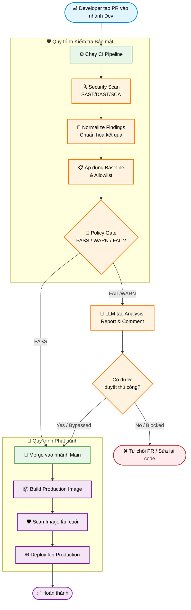

# Workflow

```mermaid
graph TD
    %% Định nghĩa phong cách chung
    classDef dev fill:#e1f5fe,stroke:#0288d1,stroke-width:2px,color:#000;
    classDef ci fill:#e8f5e9,stroke:#388e3c,stroke-width:2px,color:#000;
    classDef sec fill:#fff3e0,stroke:#f57c00,stroke-width:2px,color:#000;
    classDef deploy fill:#f3e5f5,stroke:#7b1fa2,stroke-width:2px,color:#000;
    classDef alert fill:#ffebee,stroke:#c62828,stroke-width:2px,color:#000;

    %% Định nghĩa các node trước để tránh lỗi cú pháp style
    Start([💻 Developer tạo PR vào nhánh Dev]):::dev
    CI[⚙️ Chạy CI Pipeline]:::ci
    Scan[🔍 Security Scan <br> SAST/DAST/SCA]:::sec
    Norm[🧹 Normalize Findings <br> Chuẩn hóa kết quả]:::sec
    Base[📋 Áp dụng Baseline <br> & Allowlist]:::sec
    Gate{🚦 Policy Gate <br> PASS / WARN / FAIL?}:::sec
    LLM[🤖 LLM tạo Analysis, <br> Report & Comment]:::sec
    Merge[🔀 Merge vào nhánh Main]:::ci
    Decision{Có được <br> duyệt thủ công?}:::sec
    Reject([❌ Từ chối PR / Sửa lại code]):::alert
    Build[📦 Build Production Image]:::deploy
    FinalScan[🛡️ Scan Image lần cuối]:::deploy
    Deploy[🌐 Deploy lên Production]:::deploy
    End([✅ Hoàn thành]):::deploy

    %% Tạo các liên kết giữa các node
    Start --> CI
    
    subgraph Security_Phase [🛡️ Quy trình Kiểm tra Bảo mật]
        CI --> Scan
        Scan --> Norm
        Norm --> Base
        Base --> Gate
    end

    %% Nhánh xử lý kết quả Policy Gate
    Gate -- FAIL/WARN --> LLM
    Gate -- PASS --> Merge

    LLM --> Decision
    Decision -- No / Blocked --> Reject
    Decision -- Yes / Bypassed --> Merge

    %% Giai đoạn Deploy
    subgraph Deploy_Phase [🚀 Quy trình Phát hành]
        Merge --> Build
        Build --> FinalScan
        FinalScan --> Deploy
    end

    Deploy --> End
```
